I’ve been playing Metroid Prime Remaster recently and thought the thermal vision effect was a cool idea that I’d see about recreating something similar in Unity URP.

The main goal of this project wasn’t just to create the effect, but to see what sort of setup would work well if it was in actual production in triggering the effect.

<YouTube url="https://www.youtube.com/watch?v=Vv-WuyIFiIg" />

***

## Scriptable Renderers

I went about using two Universal Renderer Data assets loaded into the Pipeline Asset and switching them at runtime on a button press. The default asset is what would be used in normal gameplay and thermal vision making use of three render features.

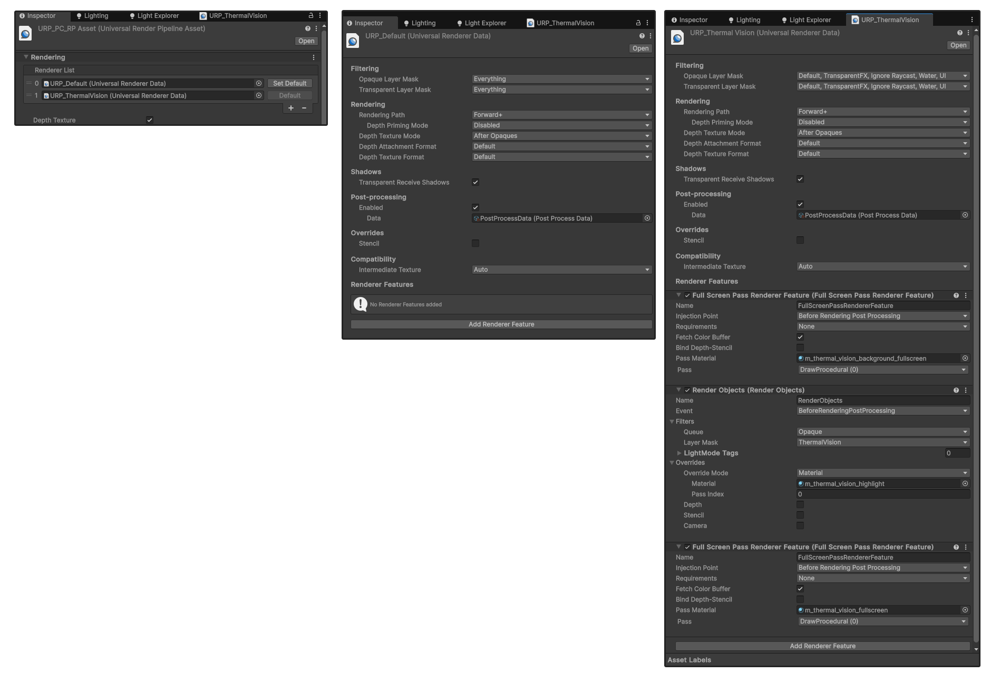

## Thermal Vision Effect

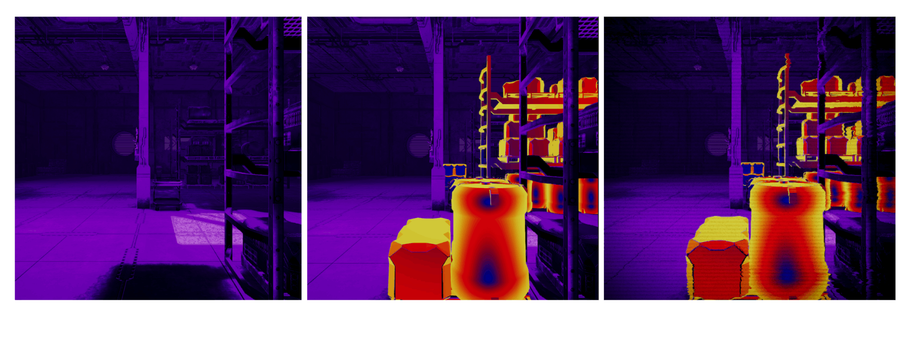

### Fullscreen Render Feature 1

The first is a Fullscreen render feature, mapping a purple gradient to the colour buffer. This gradient was made using a custom script to generate a gradient texture from a scriptable object as HLSL/Unity doesn't have a gradient input field.

A simple depth buffer based fogging is also used to make the scene less noisy.

*See the next step as to why some objects aren't visible here.*

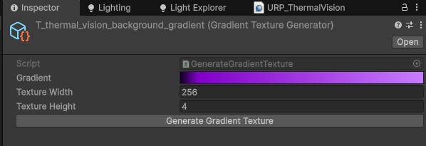

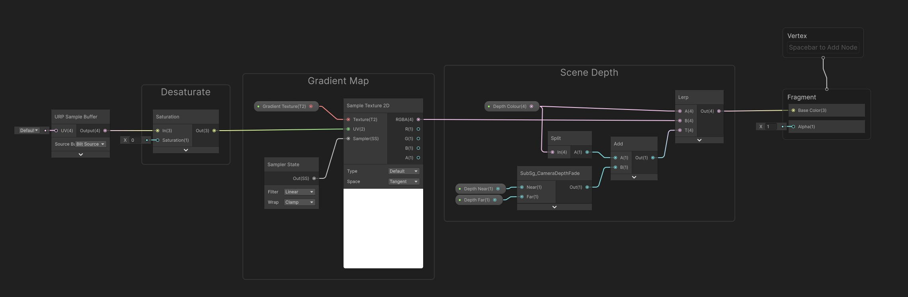

<YouTube url="https://www.youtube.com/watch?v=lglEWsNcfi8" />

***

### Render Objects Render Feature

The next is a Render Objects render feature that renders objects withing the “ThermalVision” layer with a [matcap shader](https://learn.foundry.com/modo/content/help/pages/shading_lighting/shader_items/matcap.html) to give the highlighted look. This shader also adds a small amount of vertex displacement for some extra movement.

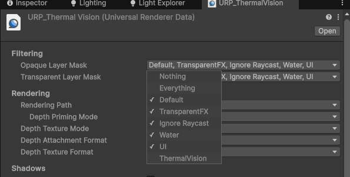

<YouTube url="https://www.youtube.com/watch?v=xPozwCLof_E" />

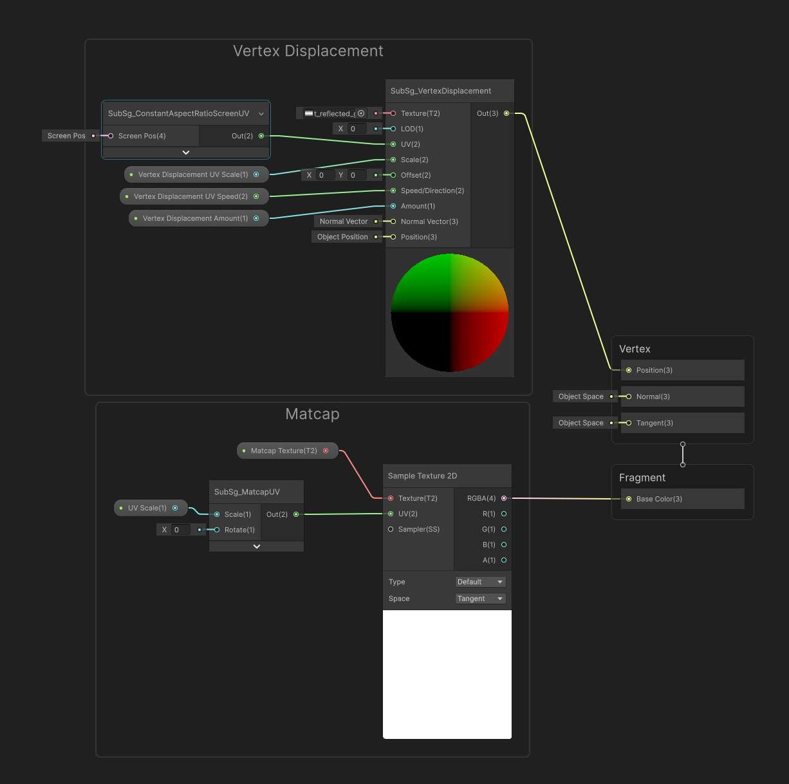

***

### Fullscreen Render Feature 2

The last feature is another Fullscreen render feature. This adds: film grain, vignetting, glitch distortion, pixelation and scanlines.

There's nothing complex going on here,  just several effects stacked on top of each other to achieve the overall effect.

<YouTube url="https://www.youtube.com/watch?v=LPYIFpIlk7Y" />

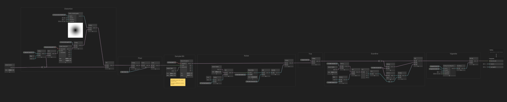

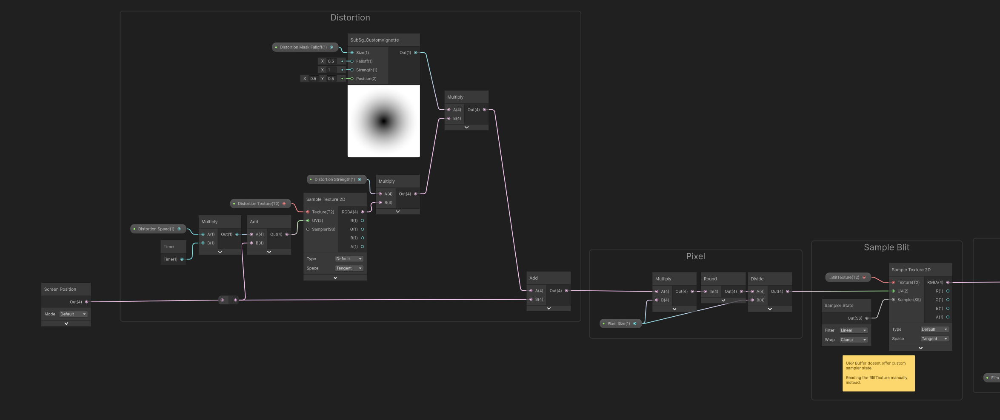

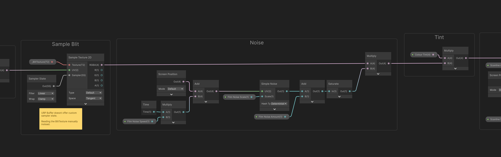

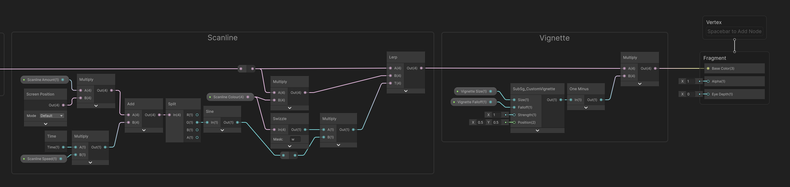

***

## C# Scripts

The next step was figuring out a way to trigger the effect. I went about creating a couple scripts for this so the approach would be modular and component based, so any effect could be hooked up without any hardcoding of “thermal vision” variables.

* SequencedEvents.cs
* MaterialAnimator.cs
* SwitchScriptableRendererData.cs
* InputToggleEvent.cs

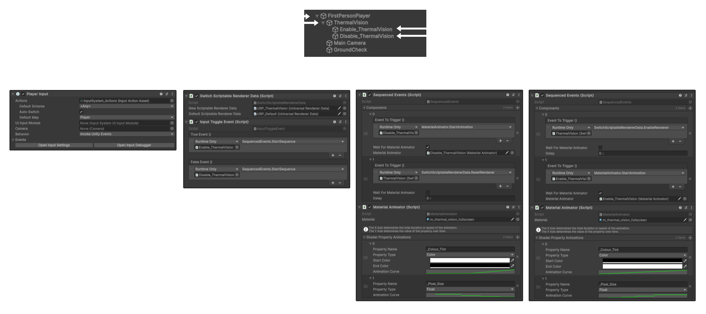

### SequencedEvents.cs

SequencedEvents.cs allows any number of Unity events on any object to fire in sequence, with optional delay between each event. This is done using a coroutine. Start the sequence by calling StartSequence().

### MaterialAnimator.cs

MaterialAnimator.cs allows material properties to animate at runtime using animation curves. Input a material, shader property name and property types, along with your animation curve, and it will animate when the StartAnimation() function is called. Like the SequencedEvents.cs, you can load multiple properties in to be animated.

As you can see by the videos above, the ability to animate along curves can give some unique looks. For instance the colour fade is a linear curve while the pixelation is stepped to give a more digital look.

### RenderPipelineSwitch.cs

RenderPipelineSwitch.cs takes two renderer assets, the default and the one you want to switch to. When the EnableRenderer() or ResetRenderer() functions are called, it will set the renderer to either.

### InputToggleEvent.cs

InputToggleEvent.cs takes two Unity Events as inputs, one for true and one false. When OnInputActionToggle() is called it flip-flops between invoking either the true event or false event. This component is designed to be called from the Unity Player Input component which fires events based on the Unity Input System as OnInputActionToggle() takes a InputAction.CallbackContext as a function argument.

Using these scripts, I’m able to set up the feature in a very modular and accessible way, allowing for additional things to be triggered or changed easily by artists or designers without the need for an engineer or technical artist. It can also be used to trigger any type or number of events so it isn't limited to just “thermal vision”.

[Check the git repo for the source code!](https://github.com/FraserHutchison/unity-urp-thermal-vision/tree/master)

SciFi Environment Asset Pack by [Sickhead Games](https://assetstore.unity.com/packages/3d/environments/sci-fi/sci-fi-construction-kit-modular-159280#publisher) on the Unity Asset Store

I'd probably change some setup here if done again but overall I think it's a solid way to trigger different types of effects. I think I'll be using these scripts again in the future for other projects as they're quite versatile along with some other scripts ive made for global event triggering so more environmental elements could also be triggered.