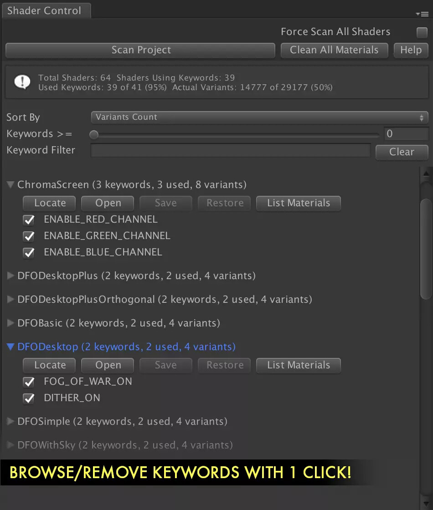
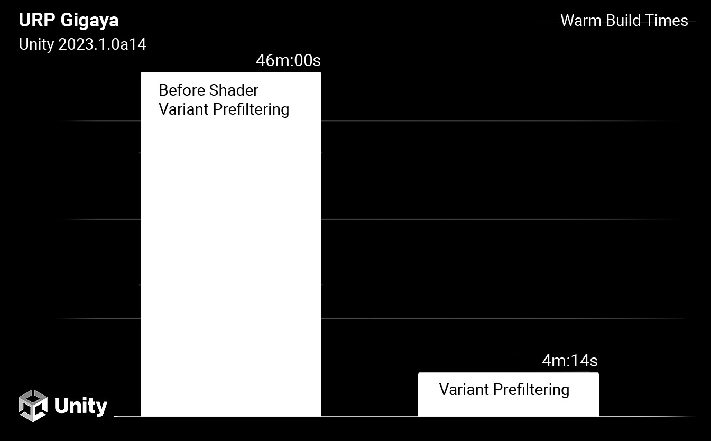
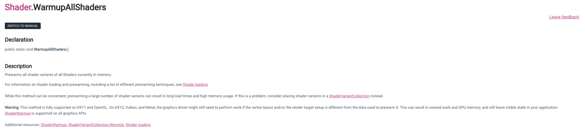
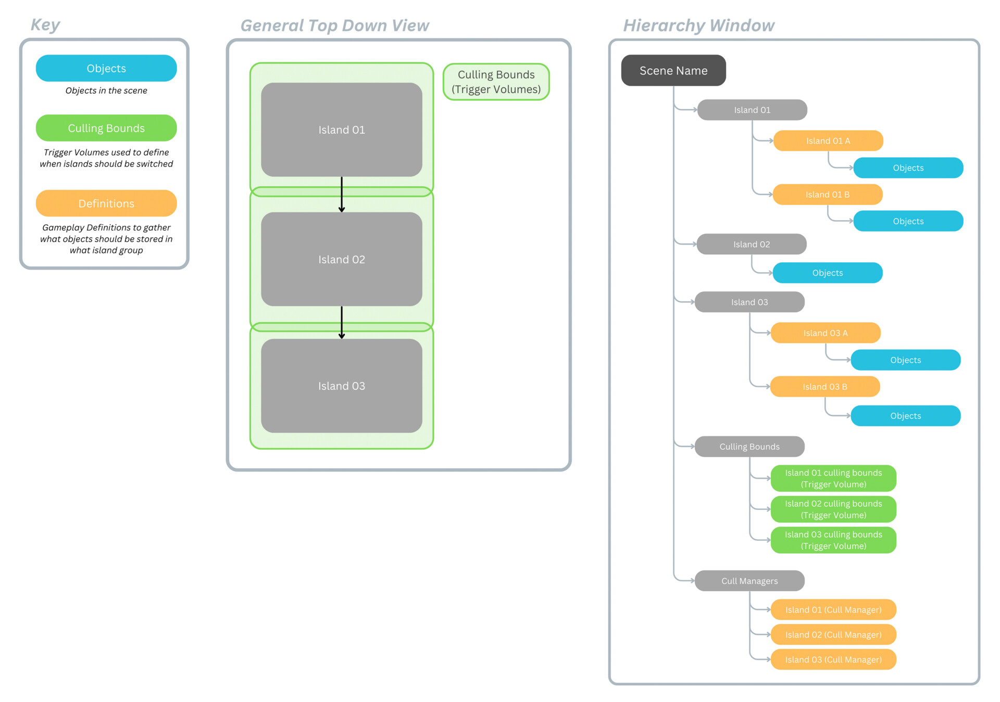
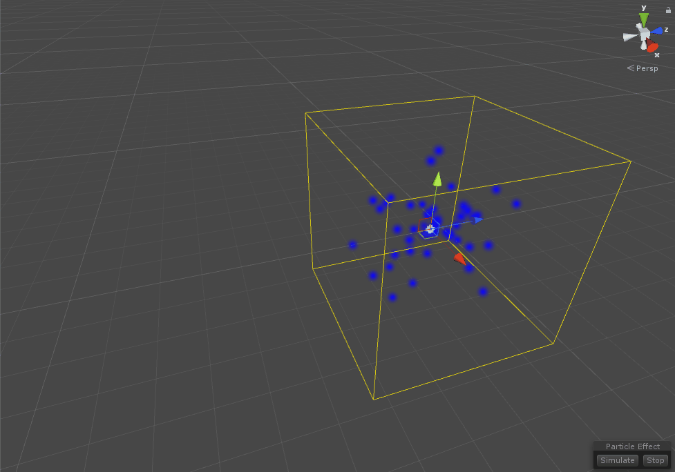
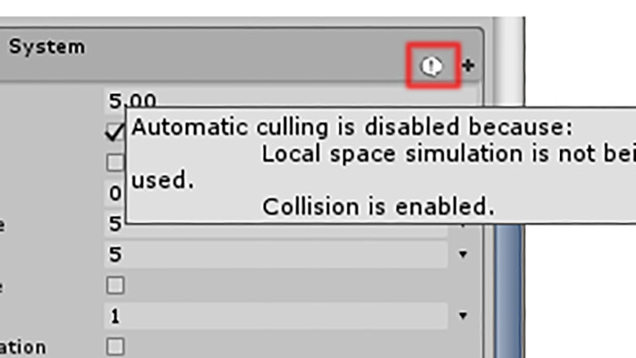
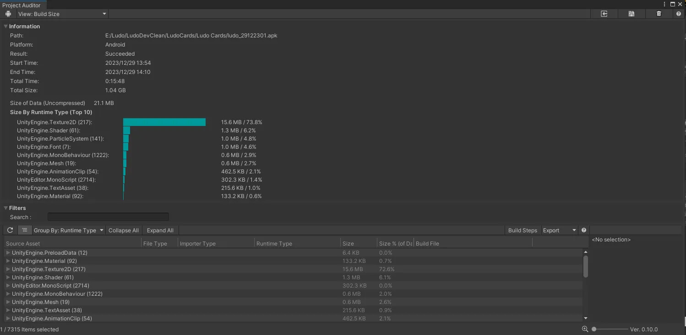

<YouTube url="https://www.youtube.com/watch?v=H0jKqUIhpik" />

## Optimisation

- Shaders Variants and Memory
- Shader Pre-Warming
- Island Culling
- Particle Culling
- Asset compression

This post covers optimisations that we used in making [Sonic Dream Team](https://apps.apple.com/us/app/sonic-dream-team/id1609094795). It's not an exhaustive list, but some of the things that spring to mind when looking back at its development.

It was a big team effort to get the game running on all devices, so thank you to everyone for making it possible!

[Sonic Dream Team](https://apps.apple.com/us/app/sonic-dream-team/id1609094795) was made specifically for [Apple Arcade](https://www.apple.com/uk/apple-arcade/), which means for all iOS devices, ranging from iPhone, iPad, Apple TV, Mac and the Vision Pro. With such a broad range of devices, performance was important, with the main emphasis having to be put on low-end devices. The target was to average 30fps on low-end and 60fps on mid to high end. 

The three key low-end devices were the [iPhone 6 (2014)](https://www.gsmarena.com/apple_iphone_6-6378.php), [iPad Air 2 (2014)](https://www.gsmarena.com/apple_ipad_air_2-6742.php) and the [Apple TV HD (2015)](https://www.apple.com/by/apple-tv-hd/specs/). These all used some variation of the A8 chip and were the least powerful of all the devices we covered. Because of that, I spent a lot of time with all three, playing the game at the absolute lowest possible settings, meaning that when I got to play the game on my [iPad Air 5th gen (2022)](https://www.apple.com/uk/shop/buy-ipad/ipad-air), I could play it on maxed out settings, making it an absolute treat!

I was the only technical artist on the project so one of my main responsibilities was profiling. This meant scheduling tasks for different teams to optimise their work, alongside implementing many optimisations myself. I did this by setting aside specific dates to review the current state of the game and profile several devices at once using [Unity's](https://docs.unity3d.com/Manual/performance-profiling-tools.html) and [XCode's profiling tools](https://developer.apple.com/documentation/xcode/performance-and-metrics). Later on in the project's development, an automated testing setup was created by the engineering team so we could get more averaged performance data and track whether different branches had big performance impacts or not. This data wasn't super detailed but gave stats like CPU and GPU time, along with device memory and what level the data was coming from. This didn't replace manual profiling but was a great way to get a more bird's-eye view. 

Something great we had access to was [Unity project reviews](https://unity.com/legal/terms-of-service/success-plans/project-review). This comes as part of the Unity Pro licence, where Unity will organise a couple of developers to review your project with you and help improve or provide knowledge into specific areas you want to know about. This was held twice throughout the project, the first being in person, running for two days in the office, and the second over a week on Zoom. It was great to have this insider knowledge as it confirmed some of our findings and helped to find things we might have missed.

Below, I've listed different areas that were the main problems and explained what we did to combat them.

## Shader Memory and Loading

### Variants

Something I think most tech and rendering teams are familiar with is shader variants, [they have become a real problem in modern game development](https://therealmjp.github.io/posts/shader-permutations-part1/). In a world where games can run on so many devices and platforms, shaders have to be adapted to work with all of them to handle the different hardware and graphics API. Unity's scriptable rendering pipelines are no exception, they provide a fantastic way to deploy to so many different devices but with the cost of high shader memory, which on Mobile doesn't fly. Most of the low-end devices only had 1-2GB of RAM, so keeping the game running on as little as possible was crucial, otherwise, it incurs crashes and device slow down. Handling memory for textures, audio and meshes was for the most part simple. Making sure to have your compression settings set, sizes of textures clamped to the lowest they can be and setting audio compression methods to what made sense per clip was easy, but for shaders, it was a different beast. 

Shader memory could easily become 4–5 times the size of the entire art memory combined, which in the beginning always caused out-of-memory crashes. Unity already has some built-in shader stripping to reduce the number of variants it generates, but not enough to decrease it to an acceptable standard. For console and PC games, this would be fine as the RAM amounts are much higher, but for low-spec mobile, it becomes a problem. During development, [Unity implemented Pre-Filtering](https://discussions.unity.com/t/improvements-to-shader-build-time-and-runtime-memory-usage/887170) and [Dynamic Shader Variant Loading](https://discussions.unity.com/t/dynamic-shader-variant-loading/894939), which helped a lot with not compiling unneeded variants meaning fewer shaders in runtime memory, but again more had to be done.

I found that certain passes like [DepthNormals](https://docs.unity3d.com/Packages/com.unity.render-pipelines.universal@15.0/api/UnityEngine.Rendering.Universal.Internal.DepthNormalOnlyPass.html) were still being compiled even though we were not using them, and various shader feature keywords were not needed. I opted to use [Shader Control on the Unity Asset Store](https://assetstore.unity.com/packages/vfx/shaders/shader-control-74817), it was a great help in understanding the keyword combinations we were using, which meant I could more easily toggle certain keywords to be stripped. However, I did find it somewhat limiting in certain areas, like the ability to globally strip keywords and passes, which I ended up creating a custom script for. 

I have since been working on a stripping system in my own time, which I hope to be able to use in the future to better control variants. But, if anyone is looking for a way to handle shader stripping without scripting it yourself, then definitely check out [Shader Control](https://assetstore.unity.com/packages/vfx/shaders/shader-control-74817). 

[Unity does have it "In-Progress" on its roadmap to improve shader stripping, so I'll eagerly wait to see what they come up with.](https://portal.productboard.com/8ufdwj59ehtmsvxenjumxo82/c/1389-improved-shader-variants-management)

## Pre-Warming

Another annoying shader-related thing is pre-warming. It is the act of preloading the shader into runtime memory so it doesn't cause GPU stuttering when playing the game. This is because the shader variant can be pre-compiled instead of compiling there and then, causing micro stutters. On high-end devices, this isn't really an issue as the compilation happens so quickly due to the power of the hardware, but once again, on low-end this can cause the "micro" stutters to become huge.

You could ask, why didn't we just collect the variants we needed in editor and strip/load them based on that data?

Well, if you are using DirectX11 or OpenGL you are in luck, but anything else like Metal, DirectX12 or Vulkan it gets complicated. U[nity provides a shader collection/pre-warming API](https://docs.unity3d.com/ScriptReference/Shader.WarmupAllShaders.html), but if you are using something like Metal (which we are) then the shader must also have the specific vertex layout group of each mesh to correctly pre-warm (load) the shader. This means you can't simply do this in the editor and instead needs to be done on the device, but we are targeting lots of devices... 

This meant, although I'm sure it is possible, we couldn't do this in the time frame we had, so instead we needed a different approach. One of the engineers was designated to create a system of "flashing" the entire level in front of the camera during the loading screen. As naive of an approach as it sounds, speaking to other developers at other studios, this seemed to be the most common approach. This meant we could pre-warm each shader in the level with the correct vertex layout group and reduce any GPU stuttering to near zero. This also meant we could pre-warm particle shaders, which was one of the main areas where we found GPU stuttering. There are still some stutters now and then, more so again on the low-end devices, but this is much more acceptable than what we had before, where it would stutter constantly when entering a level.

Another question you might have is why not do this compilation in the menu like so many games do now (I'm looking at you, The Last Of Us PC edition). Because this is a mobile game, players are much less likely to sit about and wait for a load of shaders to compile before even getting to play the game. Instead, I think waiting an extra couple of seconds per load screen is better suited to the way mobile games are played. 

## Level Optimisation

### Island Culling

One thing that didn't occur as a problem until later on in development was how islands in each zone were rendered. In the beginning, all islands in a level were rendered the entire time you were playing a mission, but when the levels became fully fleshed out with props, enemies, particles etc it became too much of a stress for the low-end devices. We weren't using the [Occlusion Culling](https://docs.unity3d.com/Manual/OcclusionCulling.html) in Unity due to poor performance results on low-end hardware, so instead the chief engineer put together a system that could toggle groups of meshes based on their parent depending on which trigger the player was in. Below is a general map of how the system works.

Because the levels were not initially designed to have culling in mind, "dog legs" and doorways had to be added as a makeshift solution to allow areas to be culled seamlessly without serious pop-in. I added various subgroups so that when a transition would happen, different parts of both islands could be temporarily rendered, meaning no weird sections where parts were not loaded. There are ways to break this I'm sure, but the majority of cases should have been covered. This was a big effort by myself, game design and the art team to implement, but the results were great. Instead of being over 16.6ms or 33.3ms, we were always under, which meant levels played much smoother.

### Particle Culling

Who would have thought particle systems could be so expensive? Well, we found out the hard way, with some levels being notoriously intense to run. These were always plastered with particle effects, which increased culling time, batch counts, transparency cost and runtime memory.

The main reason for this was having near enough all particles being rendered all the time. Initially, our island culling system wasn't adding these particles to the cull groups but after an update this fixed part of the problem. For levels that were very long in play space, [LOD groups](https://docs.unity3d.com/Manual/class-LODGroup.html) were added to cull particles at distance or swapped to lower-resolution particle systems that were still within the active cull group.

Alongside this, we also experienced particles not culling due to certain parameters being enabled that made the particles non-deterministic which means Unity could not specify how large the bounding box volumes should be, thus having them not be culled. [After finding a Unity blog post talking about this exact issue](https://unity.com/blog/engine-platform/particlesystem-performance-culling-tips), we added our own custom particle bounds script that meant non-deterministic particles could still be culled based on the camera frustum through a pre-defined volume size.

To tell if a particle is deterministic or not, look for the little exclamation mark at the top of a particle system. I don't think this is very clear on Unity's part, but I suppose with the VFX graph being the new particle system, I doubt this will be updated any time soon.

### Asset Compression

Compression settings are one of those things that if not checked regularly, can lead to some nasty surprises. What I wish I could say is Unity's asset import pipeline is fantastic! But sadly, we had some bugs with it. [Unity does allow for auto setting of import presets based on name, asset type and folder location](https://docs.unity3d.com/Manual/class-PresetManager.html), but we found that these worked sometimes but not all the time, and would vary depending on what platforms the user had installed on their PC. HARDlight does have its own system for forcing compression settings but being a new project, we thought we would try out Unity's system. Instead, we ended up with the more manual approach of asking artists to set the presets based on [some premade settings](https://docs.unity3d.com/Manual/Presets.html), all the artists would have to do was pick one. This worked a good majority of the time but as expected some things could slip through the net.

[This is where Unity's own Project Auditor tool came in handy.](https://github.com/Unity-Technologies/ProjectAuditor) This allows you to get a project-wide view, including what assets may not have their import settings set. This meant finding these assets was much easier. The tool itself also has a lot more cool features like build reports, suggested project settings and other types of asset information. It's not an openly suggested package by Unity as it is an experimental package, but regardless, definitely check it out if you are currently making a Unity project!

Conclusion
As I said, this isn't an exhaustive list but a fair few of the big hitters I found throughout the project for performance. For the most part, I see performance in games as being theoretically simple in that all it takes is to have a regular check of where your game is at throughout production (easier said than done). We were not as on it in the beginning but as time went on, this improved massively and meant we could ship the game without major performance concerns.

Check out my other blog posts on [Sonic Dream Team](https://apps.apple.com/us/app/sonic-dream-team/id1609094795) and go play the game!
