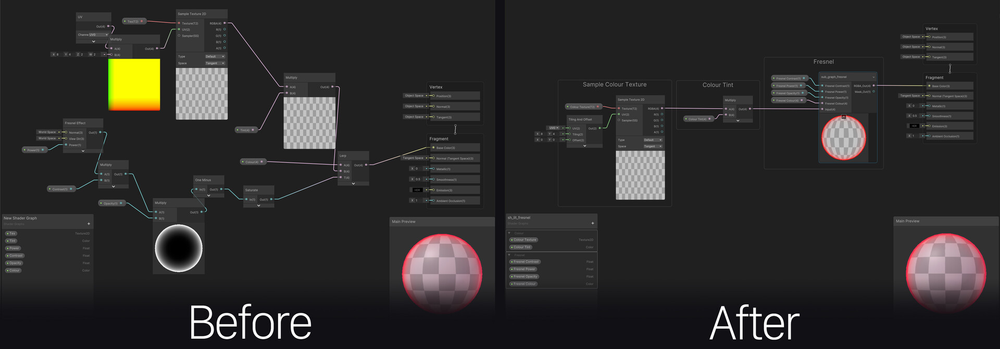
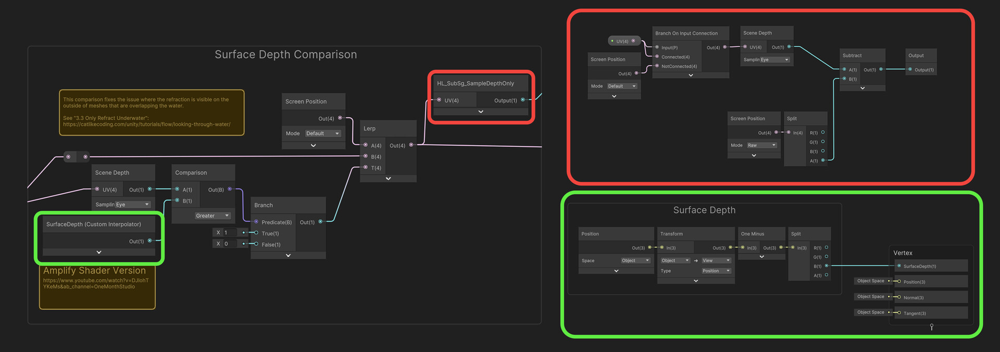
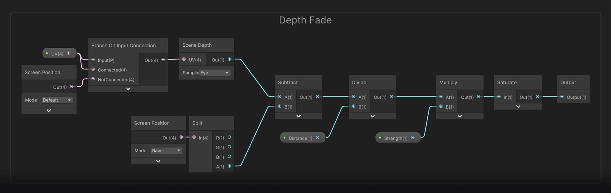

<YouTube url="https://www.youtube.com/watch?v=H0jKqUIhpik" />

## Shaders
 
* Shader Graph
* Depth Refraction Fix
* Flow Maps
* Cube Maps
* Depth Fade
* Vertex Interpolators
* Shader Graph

This post highlights some of the specific shader features created for [Sonic Dream Team](https://apps.apple.com/us/app/sonic-dream-team/id1609094795) and other shader-related things. Most of them were created using Unity’s Shader Graph in the [Universal Rendering Pipeline](https://docs.unity3d.com/Packages/com.unity.render-pipelines.universal@17.0/manual/index.html), as it makes handling stuff like lighting and iteration a lot easier. It also means there are fewer issues when updating Unity versions.

The tool has come a long way since it was first introduced. There are still some features that would be great to have, but there were only a few times when I couldn’t find a workaround for something. For any features that aren't available, look to using custom sub-graphs and custom HLSL nodes.  They make creating shaders a breeze, as I could use a lot of the same tech across all shaders and get much more custom with the effects. [Unity now even has an updated URP sample project that covers a lot about extending the editor to fit your needs.](https://www.youtube.com/watch?v=lg1W3Deoprg)

Below is a list of areas that were both extended or used.

## Shader Graph 

I opted to use a custom GUI setup for all the shaders, so they had a consistent visual interface and allowed for some more flexibility with the layout of things. To make things super easy, we used [Needle's Shader Graph Markdown tool](https://assetstore.unity.com/packages/tools/gui/shader-graph-markdown-194781), which I highly recommend. It meant I could add things like clickable documentation links, better headings, help text and also disabling groups of properties based on toggles. All these helped to make the shaders more user-friendly for the art team and understand better what each property was doing.

<YouTube url="https://www.youtube.com/watch?v=ZCuNL5A1YqA" />

## Cleanliness and Properties

Graph cleanliness was something I tried to keep in mind throughout all shaders, as node-based systems can get very messy, very quickly. Using reroute nodes, groups and notes was a big help in making things more readable. One thing I would love for Unity to add, is the ability to set and get outputs. There are tools out there that do allow this (even third party Unity packages), but I would love for this to be an inbuilt feature.

Beware of property names! In the beginning, it can be easy to name things all sorts of names, but after a while, this starts to make things tricky as if you want to rename something, it will break the property value on materials. The chief engineer at [HARDlight](https://www.hardlightstudio.com/) was able to create a tool for me to help mass update these names, but it was a lot easier to just get into the habit of sticking to certain names from the start.

I guess this is why some of Unity’s own shader property names are a bit wacky…

## Shaders

### Depth Refraction Fix

There was a lot of iteration around the water shader as its purpose changed over development. In the beginning, it was going to be more of an ocean and shoreline shader, but instead, we opted for these “ribbons” of water which made the effect more like a waterfall.

It is relatively standard for a water shader but does have some extra things added for our use case. I won't cover all the effects but for one, the depth refraction fix. I think it’s a fairly accepted thing in games, that when doing naive refraction by distorting the opaque buffer, objects above the water surface but facing it will have distorted edges. Luckily, I was able to find a fix online for this by the notorious [Catlike Coding](https://catlikecoding.com/), they covered this exact topic in the post [“Looking through Water”](https://catlikecoding.com/unity/tutorials/flow/looking-through-water/). I was able to adapt the code into nodes and get the fix working.

Was this a bit overkill? Sure! But I think it came out well in the end...

<YouTube url="https://www.youtube.com/watch?v=9DnTQxLdhT0" />

### Flow Maps

I used flow maps a few time throughout the project (the zone 2 goo and full-screen "dream" effect mostly), this was done using a custom sub-graph I made and achieved some great visuals. Unity now even has an example of flow maps in their [new Shader Graph package sample](https://docs.unity3d.com/Packages/com.unity.shadergraph@17.0/manual/ShaderGraph-Samples.html). I haven't checked it out myself yet, but from the video [Ben Cloward put out on Unity's YouTube channel](https://www.youtube.com/watch?v=7Rqrk8hMooU), it looks like a fantastic resource.

We didn't have time to create any fancy way of painting these maps in editor, so it was done by hand instead. For future projects I would love for us to be able to do this in editor as I think it could open the door for a lot of cool effects. On a side note, I've been dabbling in my own time with creating a painting tool, but it's not quite where I want it just yet. Maybe I'll make a blog post when it's done.

<YouTube url="https://www.youtube.com/watch?v=AlMpBSavtu8" />

If you have never used flow maps before, definitely check them out! They are a really cool way of adding unique movement to boring one directional scrolling and are a simple thing to set up. They are used all the time in games and aren't anything knew, but I think it can be easily overlooked with mobile games especially. [Check out this great GDC talk by Shaoyong "Abel" Zhang where he talks about their use in Mobile gaming to learn more.](https://www.gdcvault.com/play/1025044/Applying-AAA-Techniques-on-Mobile)

<YouTube url="https://www.youtube.com/watch?v=Hy7nX23GoXY" />

### Cube maps on animated Sky Boxes

In Zone 2 and 3 I created a shader which I named "trippy sky". It is two [perlin noise](https://en.wikipedia.org/wiki/Perlin_noise#:~:text=Perlin%20noise%20is%20a%20procedural,details%20are%20the%20same%20size.) textures that pan over each other to create a continuous undulating noise. Applying a gradient map to this made a psychedelic pattern that worked great for the visual we were going for. In Zone 3 however, we had a lot of background geometry that we wanted to bake into textures to save on rendering complex shapes and reduce batching. Instead of doing this with [imposters](https://www.gamedeveloper.com/programming/imposters), I baked all the geometry to a cube map with a sort of "green screen" alpha. This meant I could simply sample the texture in the sky box shader and get the same background geometry visuals. This saved multiple precious milliseconds on the CPU in rendering.

Much like the flow maps, we didn't have time to create a tool that could automate the bake process as this was a late in production addition, but if we were to use this same type of thing again in the future, having that tool would make things a lot easier.

There are some limitations to this process of course, the main being anything that is moving, now won't move. In our case, this was the waterfalls. This wasn't a big deal to us as with it being a game (especially a mobile game), players aren't really looking at the background too much and are instead focusing on going fast through the levels (it is a Sonic game after all).

Thinking back now, flow maps could be used instead to animate the backdrop! This could get a bit more costly compared to typical flow mapping, but it's definitely something that could be done if needed. 

<YouTube url="https://www.youtube.com/watch?v=oPEcjoLqQzc" />

### Depth Fade

[Depth Fade](https://www.youtube.com/watch?v=2BxrGjPcirk) is a great effect to have in your tool belt, it has so many applications and is a simple effect to set up (providing you have access to the depth buffer of course). I used it multiple times throughout the game from water foam (Zone 1), colour depth (Zone 1/2/3) and adding transparency to object intersections (Zone 4). Allowing assets to blend with other objects can really help to meld the world together and create effects that look more complex than they really are. There are caveats to the effect of course, like the asset having to be in the transparent queue and transparent objects not affecting the depth buffer, but regardless, if you know the shortcomings you can still create some cool visuals.

An alternative to using the depth buffer could instead be mesh SDFs, but as Unity doesn't natively support this ([technically it does but not on a mass scale)](https://github.com/Unity-Technologies/com.unity.demoteam.mesh-to-sdf), that is something you would have to add yourself, but it is possible and there's even[ GitHub repos out there showing how](https://github.com/EmmetOT/IsoMesh). Using SDFs would also bypass certain restrictions that the depth buffer has like not working on transparent objects.

<YouTube url="https://www.youtube.com/watch?v=lNfeUBTOOfA" />

### Custom Vertex Interpolation

[An often overlooked aspect of shader graphs (all node based shader editors really), is vertex interpolators.](https://docs.unity3d.com/Packages/com.unity.shadergraph@13.1/manual/Custom-Interpolators.html#:~:text=To%20use%20this%20feature%2C%20create,block%20in%20the%20Fragment%20context.) This allows you to calculate something in the vertex stage and pass it to the fragment. Although Unity's shader compiler is very smart and will often auto convert certain aspects of your shader to the vertex stage, it won't always and regardless, sometimes you may want to use your vertex calculation in the fragment stage.

Making calculations per vertex is far cheaper than per pixel, but there are caveats like lower precision and texture sampling looking very different to per pixel. But, you don't always need high precision, which is why doing some stuff per vertex is just better. For Mobile, but for all games really, making stuff cheaper will allow for better performance and even options to add more cool stuff. The nodes for this are inbuilt in Unity so no external packages are required, so go check it out!

<YouTube url="https://www.youtube.com/watch?v=Mso_52KEesA" />

## Conclusion

That concludes some of the highlights for the [Sonic Dream Team shaders](https://apps.apple.com/us/app/sonic-dream-team/id1609094795). There's a lot of cool stuff that can be done with shaders, even on mobile hardware. Hardware has come a long way, especially recently, so it shouldn't stop you from trying things out!

Check out my other blog posts on Sonic Dream Team, where I talk about optimisations we did to hit 30fps and 60fps on very low or very high spec hardware.
