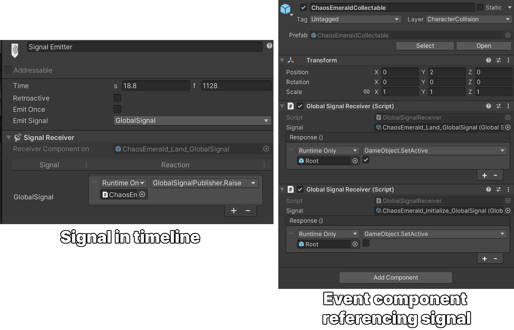

This update introduced Shadow as a playable character in Sonic Dream Team, complete with his signature Chaos abilities. I worked on VFX and shaders for his powers, and also got to contribute to an area I hadn’t been involved in much before—cutscenes!

<YouTube url="https://www.youtube.com/watch?v=7jkKrwbeW9I" />

---

## VFX

We used the same VFX setup as the rest of the game, utilising Unity's particle system (rather than Unity VFX Graph, since some of our [target devices don't support compute shading](https://docs.unity3d.com/Packages/com.unity.visualeffectgraph@17.3/manual/System-Requirements.html)).

<Video src="./sega-sdt-shadow-pfx.mp4" autoplay loop muted />

The fullscreen effects could reuse the same technology from the game, requiring only minor changes to expose more properties. The core effect is driven by the flow map, [which I've blogged about before](https://fraserh.dev/2024/02/09/sega-sdt-shaders/). Rather than controlling property animation directly through the shader, we use a material animator created by the engineering team. This approach allows me to build a versatile shader that achieves its best visual results when animated in sequence. Though that being said, it's not the most usable friendly system, in the future I have plans to upgrade this to allow non programmers to create these effects more easily.

<Video src="./sega-sdt-shadow-fullscreen-vfx.mp4" autoplay loop muted />

---

## Cutscenes

For our cutscenes, we used [Unity’s Timeline](https://docs.unity3d.com/Manual/com.unity.timeline.html) in combination with a dedicated cutscene prefab that contains all relevant objects for each scene. This prefab is instantiated into the level as needed, and the Timeline is then played. Working in Timeline is a lot of fun—it and offers real-time playback, which makes it easy to fine-tune every aspect of the cutscene. I was responsible for implementing the cutscenes in-game, including all visual effects and lighting. Audio was handled internally, while animation was provided by [Superspline](https://supersplinestudios.com/). Given how short the cutscenes are, I think they turned out really well - and always a surprise to see first hand just how long even a few seconds of a cutscene can take to create!

<YouTube url="https://www.youtube.com/watch?v=VJ-drfyWapI" />

---

## Timeline Global Events

One piece of minor engineering work I did was enabling Unity's Timeline to send global events. By default, [Timeline signals](https://unity.com/blog/engine-platform/how-to-use-timeline-signals) are local, which posed a problem since our cutscene prefabs are instantiated at runtime — any references to objects outside the prefab would break. With help from our chief engineer, we developed a solution where a Timeline event could trigger a ScriptableObject-based global event. This allowed receivers anywhere in the level — even outside the prefab, to listen and respond accordingly. This system enabled setups like the Chaos Emerald landing sequence, where the Dream Orb and various environment elements were activated precisely on impact.

<Video src="./sega-sdt-shadow-timeline.mp4" autoplay loop muted />

---

## Corruption

The “Corruption” feature was also introduced in this update. I contributed with performance optimisation and creating new shaders for the corrupted goo on the ground and the undulating tentacles. As with previous VFX work, I adapted our existing shader systems to support the new visuals. The most notable aspect was the tentacle undulation effect. This was achieved by baking a vertex colour gradient along the tentacle’s spline, which then drove a sine wave motion across the mesh. This vertex colour functionality was powered by [Dreamteck Splines](https://assetstore.unity.com/packages/tools/utilities/dreamteck-splines-61926?srsltid=AfmBOoqflSg7pJrK4ksIEZUk0GXcyiGcTBrKoNW4xXx8lLJoOtj4y3Ra), the spline system used throughout this game.

<Video src="./sega-sdt-shadow-tentacles.mp4" autoplay loop muted />

<YouTube url="https://www.youtube.com/watch?v=fsETxI5tMjo" />
